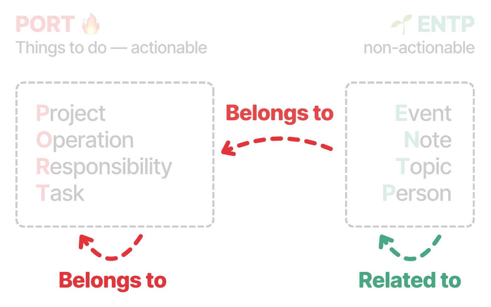
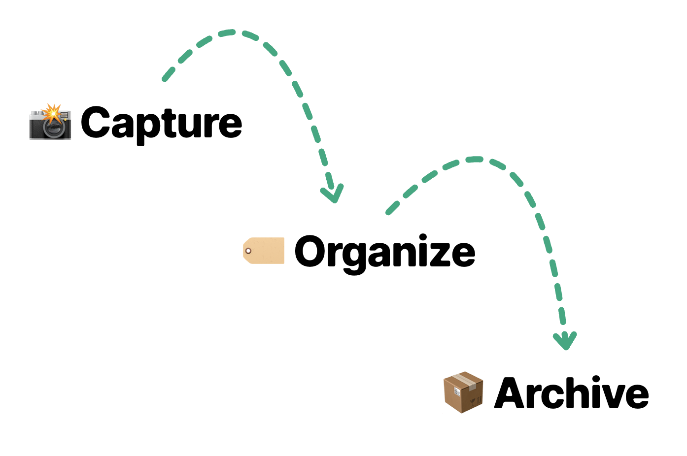

# Portent

Portent is an open specification for work and personal knowledge bases.

It gives you a small set of defaults for organizing information: clear types,
generic graph-like relationships, and a simple lifecycle for captured knowledge.
The goal is to make a knowledge base easy for humans and agents to understand,
without forcing every team or person to invent a custom system first.

Portent favors convention over configuration. Instead of asking “where should
this go?”, it asks:

- What is this?
- What is it useful for?
- Is it captured, organized, or archived?

## Core Ideas

### Types

Portent defines eight default types. PORT types are actionable things to do:
Projects, Operations, Responsibilities, and Tasks. ENTP types are
non-actionable knowledge records: Events, Notes, Topics, and People.


### Relationships

Portent models knowledge as a graph. The two default relationships are:

- `belongs_to`: an ownership or composition relationship.
- `related_to`: a looser semantic connection.

These defaults are enough to model most knowledge bases while staying easy to
extend when a system needs more specific relationship names.



### Lifecycle

Portent separates capture from organization:

- **Capture** information quickly so it is not lost.
- **Organize** it by assigning a type and useful relationships.
- **Archive** it when it has served its purpose.



## Compatibility

A Portent-compatible knowledge base needs:

- A way to assign one Portent type to each item.
- A way to express lifecycle state, either with separate properties or a single
  status property.
- A way to link items through relationships, such as Markdown wikilinks or
  frontmatter fields.

Portent is easiest to implement in Tolaria, but it is designed to be portable
across file-based systems, note apps, docs tools, and agent-readable vaults.

## Links

- Website: <https://portent.md>
- Template vault: <https://github.com/refactoringhq/portent-vault-template>
- Spec repository: <https://github.com/refactoringhq/portent>

## Website

The documentation site is built with VitePress.

```bash
pnpm install
pnpm docs:dev
```

The VitePress site lives in `site/`.
